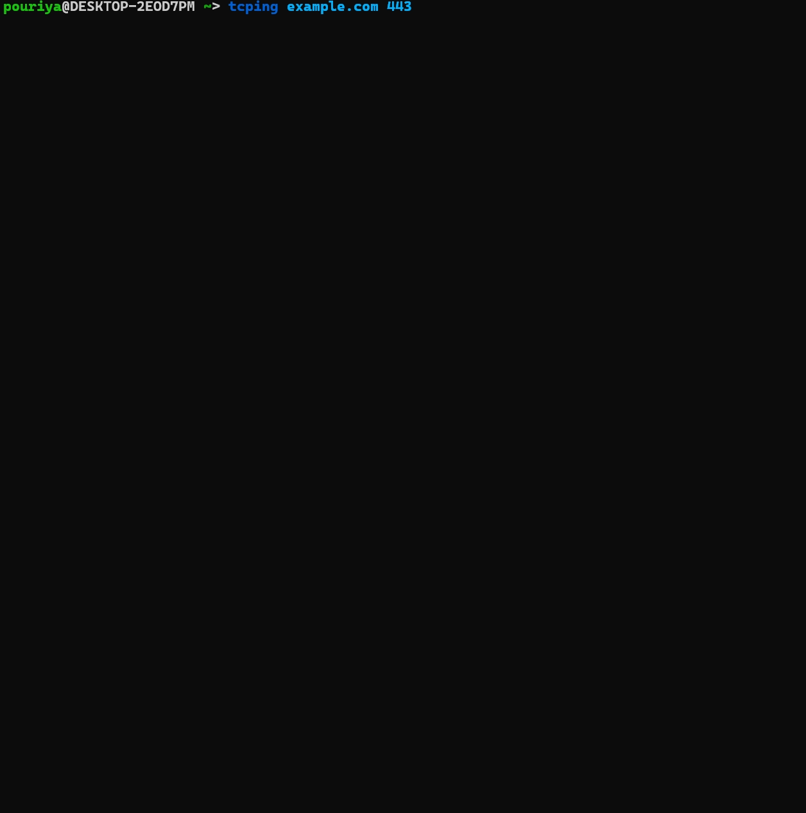

# TCPING

A cross-platform ping program for ```TCP``` ports inspired by the Linux's ping utility. This program will send ```TCP``` probes to an ```IP address``` or a ```hostname``` specified by you and prints the result. It works with both `IPv4` and `IPv6`.

It uses a different `TCP sequence numbering` for successful and unsuccessful probes, so that when you look at the results and spot a failed probe, understanding the total packet drops to that point would be illustrative enough.

## Features And Application

* Monitor your network connection.
* Print connection statistics on `Enter` key press.
* Calculate packet loss.
* Assess the latency of your network.
* Show `min`/`avg`/`max` probes latency.
* Display the longest encountered downtime's duration and time.
* Monitor and audit your peers network.
* Calculate the total uptime/downtime when conducting a maintenance.
* An alternative to `ping` in environments that `ICMP` is blocked.

## Demo



## Download the executables for

* ### [Windows](https://github.com/pouriyajamshidi/tcping/releases/latest/download/tcping_Windows.zip)

* ### [Linux](https://github.com/pouriyajamshidi/tcping/releases/latest/download/tcping_Linux.zip)

* ### [macOS](https://github.com/pouriyajamshidi/tcping/releases/latest/download/tcping_MacOS.zip)

In addition to downloading the executables, you can:

* Install it using `go get github.com/pouriyajamshidi/tcping`
* Or compile the code yourself by running the `make` command inside the cloned directory:

    ```bash
    make build
    ```

## Usage

Go to the directory/folder in which you have downloaded the application and extract the compressed file.

### On ```Linux``` and ```macOS```

```bash
sudo chmod +x tcping
```

For easier use, you can copy it to your system ```PATH``` like /bin/ or /usr/bin/

```bash
sudo cp tcping /usr/bin/
```

Then run it like, `tcping <hostname/IP address> <port>`. For instance:

```bash
tcping www.example.com 443
```

OR

```bash
tcping 10.10.10.1 22
```

### On ```Windows```

I recommend ```Windows Terminal``` for the best experience and proper colorization.

For easier use, copy ```tcping.exe``` to your system ```PATH``` like C:\Windows\System32 or from your terminal application, go to the folder that contains the ```tcping.exe``` program.

Run it like:

```powershell
tcping www.example.com 443
```

OR

```powershell
.\tcping.exe 10.10.10.1 22
```

**Please note, if you copy the program to your system ```PATH```, you don't need to specify ```.\``` and the `.exe` extension to run the program anymore.**

## Tips

* While the program is running, press the `Enter` key to view the summary of all probes without exiting the program as depicted in the [demo](#Demo).

## Notes

There are several shortcomings that I will rectify in the near future and some parts might not make much sense because this program was mainly designed to help me learn and experiment with `Go`.

## Contributing

Pull requests are welcome to solve bugs, add new features and also to help me with the open issues that can be found here .

1. Pick any issue that you feel comfortable with.
2. Create a branch.
3. Commit your work.
4. Create a pull request

Please make sure to only work on a specific issue on your pull request and not address two or more tickets in one. This will help me to easier review your pull request and also contributes to a cleaner git history.

## Tested on

Windows, Linux and Mac OS.

## License

[](https://opensource.org/licenses/MIT)
