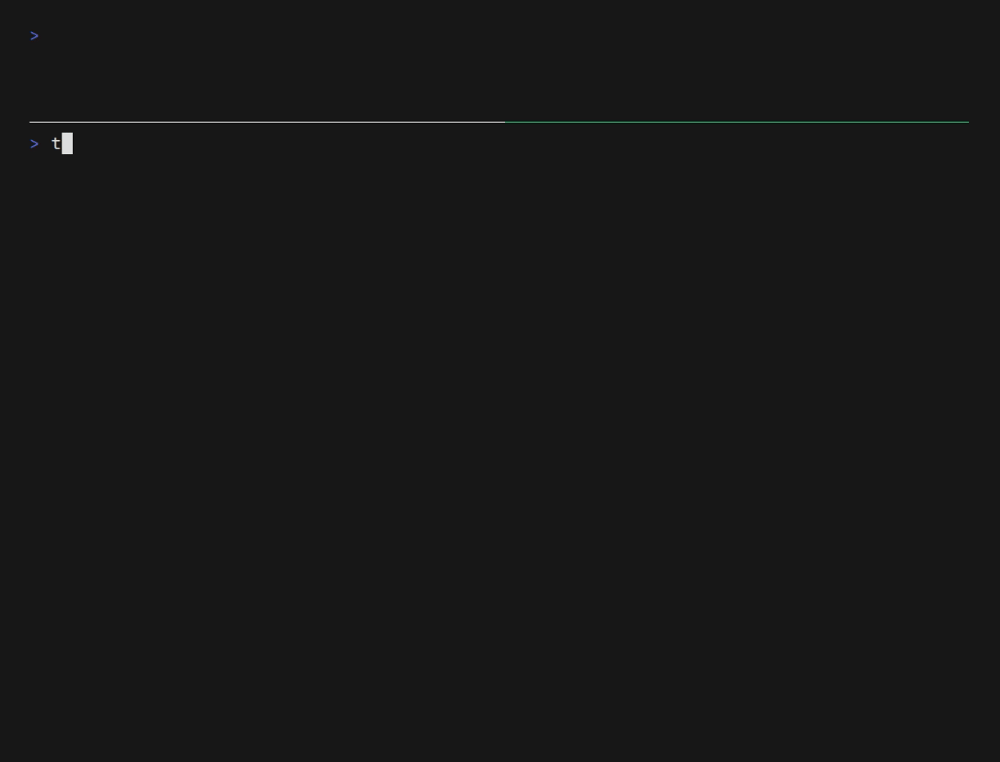
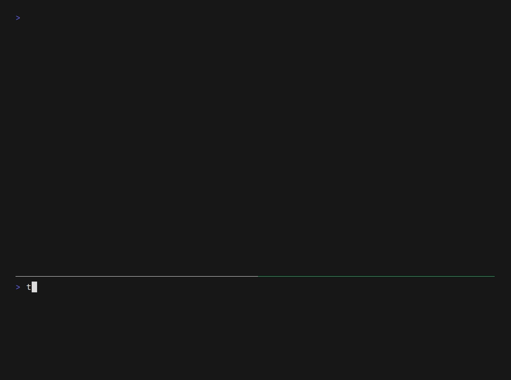

<div align="center" style="width: 100%;">
 
</div>

# TCPING


> [!CAUTION]
> This is a work in progress branch, not the main one.

A cross-platform ping program using `TCP`, `UDP` or `HTTP(S)` instead of `ICMP`, inspired by Linux's ping utility.

> [!TIP]
> This document is also available in [中文](README.cn.md).

- An alternative to `ping` where `ICMP` is blocked, probing over `TCP`, `HTTP(S)` or `UDP`.
- Reports the packet loss and the minimum, average, maximum and mean deviation of the latency, the same way `ping` does, plus the longest uptime and downtime and when they happened.
- Prints the statistics at any time by pressing the `Enter` key, without stopping the program.
- Outputs in **colored**, **plain**, **JSON**, **CSV** or **sqlite3** format, or sends every probe to **Grafana Alloy** or **InfluxDB** as metrics.
- Shows the status code, the TLS version and cipher, the certificate expiry and the connect, TLS handshake and first-byte timings of every `HTTP(S)` probe.
- Resolves the target's hostname again after a number of failures (`-r`) or before every probe (`--resolve-every-probe`), and reports how long each lookup took. Suitable to test your `DNS` load balancing or Global Server Load Balancer `(GSLB)`.
- Lets you pick the **source interface**, the **timeout**, the **interval** and the **DNS server**, and enforce `IPv4` or `IPv6`.
- Numbers _successful_ and _unsuccessful_ probes separately, so the totals are visible at a glance.

Check out the [demos](#demos) to get a look and feel of **tcping**.

---

## Table of Contents

- [Demos](#demos)
- [Download and Installation](#download-and-installation)
- [Usage](#usage)
- [Flags](#flags)
- [Contributing](#contributing)
- [Help The Project](#help-the-project)
- [License](#license)

---

## Demos

<details>
<summary>Click to expand</summary>

### Basic usage


---

### Timestamped probes over IPv4 (`-D -4`) flags


---

### Plain output, statistics only when Enter is pressed (`--no-color --no-stats`) flags


---

### Retry hostname lookup (`-r`) flag


---

### JSON output (`-j --pretty`) flag


---

### Streaming the JSON output to a collector (`--json-url --json-server`) flags



---

### Hostname resolution timing (`--resolve-every-probe`) flag


---

### Source interface (`-I`) flag


---

### HTTP(S) probes


---

### HTTP(S) probe details (`-v`) flag


---

### Skipping certificate verification (`--insecure`) flag


---

### UDP probes against a UDP server (`--udp-server`) flag



---

### Only the failed probes (`--failures-only`) flag


</details>

---

## Download and Installation

| Platform | Install with |
| --- | --- |
| [Windows](#windows) | `winget install pj.tcping` |
| [macOS](#macos) | `brew install pouriyajamshidi/tap/tcping` |
| [Debian, Ubuntu](#linux---package-repositories) | `sudo apt install tcping`, after adding the repository |
| [Fedora, RHEL, CentOS](#linux---package-repositories) | `sudo dnf install tcping`, after adding the repository |
| [Alpine](#linux---package-repositories) | `sudo apk add tcping`, after adding the repository |
| [Arch, Manjaro](#linux---package-repositories) | `yay -S tcping-bin` |
| [Any Linux](#linux---one-line-install) | a [one-line install](#linux---one-line-install) or a [package file](#linux---package-files) |
| [BSD](#bsd-and-linux---manual-way) | the [prebuilt binary](#bsd-and-linux---manual-way) |
| [Nix](#nix) | `nix profile install github:pouriyajamshidi/tcping` |
| [Docker](#other-ways) | `docker run -it pouriyajamshidi/tcping example.com 443` |
| [Go](#other-ways) | `go install github.com/pouriyajamshidi/tcping/v3@latest` |

The binaries are static, meaning they carry everything they need inside one file
and do not depend on any library being present on your machine. They live on the
[release page](https://github.com/pouriyajamshidi/tcping/releases/latest/), for
_amd64_ and _arm64_.

Once you are done with the installation, head to the [usage](#usage) section.

### Windows

The best way to install **tcping** on Windows is through _Windows Package Manager_ by utilizing [WinGet](https://learn.microsoft.com/en-us/windows/package-manager/winget/?ref=github.com%2Fpouriyajamshidi%2Ftcping), which is available on practically all Windows _10_ and _11_ machines by default since September of 2020:

```powershell
winget install pj.tcping
```

To install it by hand instead, extract the downloaded zip file and copy `tcping.exe` to your system [PATH](https://www.howtogeek.com/118594/how-to-edit-your-system-path-for-easy-command-line-access/) like `C:\Windows\System32`.

> [!CAUTION]
> TCPING might falsely get flagged by Windows Defender or some anti-malware software. This is common among Go programs. Check out the official statement from the Go team [here](https://go.dev/doc/faq#virus).

> [!WARNING]
> The `--sqlite` (sqlite3) output format is not available on Windows binaries anymore. All the other flags work as expected.

### macOS

```bash
brew install pouriyajamshidi/tap/tcping
```

### Linux - One-line install

Paste the following in your terminal to grab the latest binary for your architecture and install it:

```bash
cd /tmp &&
ARCH=$(uname -m | sed 's/x86_64/amd64/; s/aarch64/arm64/') &&
curl -LO "https://github.com/pouriyajamshidi/tcping/releases/latest/download/tcping-linux-$ARCH.tar.gz" &&
tar -xf "tcping-linux-$ARCH.tar.gz" &&
sudo install tcping /usr/local/bin/ &&
sudo install -Dm 644 completions/tcping.bash /usr/share/bash-completion/completions/tcping &&
sudo install -Dm 644 completions/_tcping /usr/share/zsh/site-functions/_tcping &&
sudo install -Dm 644 completions/tcping.fish /usr/share/fish/vendor_completions.d/tcping.fish &&
tcping --version
```

The last three lines install the [shell completions](#shell-completions). Drop
the ones for the shells you do not use, and start a new shell to pick them up.

If you don't have `curl`, swap its line for `wget`:

```bash
wget "https://github.com/pouriyajamshidi/tcping/releases/latest/download/tcping-linux-$ARCH.tar.gz" &&
```

### Linux - Package repositories

Adding the repository once means `apt`, `dnf` or `apk` handles installs and
upgrades from then on, like any other package.

**Debian**, **Ubuntu** and their flavors:

```bash
sudo install -d /etc/apt/keyrings &&
  sudo curl -fsSL https://pouriyajamshidi.github.io/packages/keys/pouriyajamshidi.gpg -o /etc/apt/keyrings/pouriyajamshidi.gpg &&
  echo "deb [signed-by=/etc/apt/keyrings/pouriyajamshidi.gpg] https://pouriyajamshidi.github.io/packages/deb ./" | sudo tee /etc/apt/sources.list.d/pouriyajamshidi.list &&
  sudo apt update &&
  sudo apt install tcping
```

**Fedora**, **RHEL**, **CentOS** and their flavors:

```bash
sudo curl -fsSL https://pouriyajamshidi.github.io/packages/rpm/pouriyajamshidi.repo -o /etc/yum.repos.d/pouriyajamshidi.repo &&
  sudo dnf install tcping
```

**Alpine**:

```bash
sudo curl -fsSL https://pouriyajamshidi.github.io/packages/keys/pouriyajamshidi.rsa.pub -o /etc/apk/keys/pouriyajamshidi.rsa.pub &&
  echo "https://pouriyajamshidi.github.io/packages/apk" | sudo tee -a /etc/apk/repositories &&
  sudo apk update &&
  sudo apk add tcping
```

**Arch**, **Manjaro**, **EndeavourOS** and their flavors have it on the
[AUR](https://aur.archlinux.org/packages/tcping-bin), so use your favorite helper:

```bash
yay -S tcping-bin
```

### Linux - Package files

Without adding a repository, download the package for your distro from the
[release page](https://github.com/pouriyajamshidi/tcping/releases/latest/) and
install it:

| Distro | Package | Install |
| --- | --- | --- |
| Debian, Ubuntu | `tcping-amd64.deb` | `sudo apt install -y ./tcping-amd64.deb` |
| Fedora, RHEL, CentOS | `tcping-amd64.rpm` | `sudo dnf install -y ./tcping-amd64.rpm` |
| Arch, Manjaro | `tcping-amd64.pkg.tar.zst` | `sudo pacman -U ./tcping-amd64.pkg.tar.zst` |
| Alpine | `tcping-amd64.apk` | `sudo apk add --allow-untrusted ./tcping-amd64.apk` |

Swap `amd64` for `arm64` on ARM machines. All four install the binary and the
[shell completions](#shell-completions) for you. Machines without `dnf` can use
`yum` instead, and Alpine needs `--allow-untrusted` because our packages are not
signed with an Alpine key.

### BSD and Linux - Manual Way

Download the file for your respective OS and architecture:

```bash
wget https://github.com/pouriyajamshidi/tcping/releases/latest/download/tcping-freebsd-amd64.tar.gz
# Or for Linux ARM64 machines and using cURL
curl -LO https://github.com/pouriyajamshidi/tcping/releases/latest/download/tcping-linux-arm64.tar.gz
```

Extract it and copy the executable to your system `PATH` like `/usr/local/bin/`:

```bash
tar -xvf tcping-freebsd-amd64.tar.gz &&
  chmod +x tcping &&
  sudo cp tcping /usr/local/bin/
```

The archive also carries a `completions` folder. See [Shell Completions](#shell-completions) to install them.

### Nix

**tcping** ships a flake, so on any machine that has [Nix](https://nixos.org/download/)
you can run it without installing anything:

```bash
nix run github:pouriyajamshidi/tcping -- example.com 80
```

Or install it for good:

```bash
nix profile install github:pouriyajamshidi/tcping
```

Both give you the binary and the [shell completions](#shell-completions). The
flake also has a `devShells.default` with everything needed to work on tcping,
which you get with `nix develop`.

### Other ways

- `Docker` images:

  ```bash
  docker pull pouriyajamshidi/tcping:latest
  # Or
  docker pull ghcr.io/pouriyajamshidi/tcping:latest
  ```

- Using `go install`:

  > This requires at least go version `1.26.8`

  ```bash
  go install github.com/pouriyajamshidi/tcping/v3@latest
  ```

- [x tcping](https://x-cmd.com/pkg/tcping):

  **Directly without installation** in [x-cmd](https://www.x-cmd.com).

  ```bash
  x tcping example.com 80
  ```

  Or install `tcping` locally using x-cmd, without needing root privileges or affecting your global setup.

  ```bash
  x env use tcping
  tcping example.com 80
  ```

- Finally, you can compile the code yourself by running the `make` command:

  ```bash
  make build
  ```

  This will place the executables in the `output` folder.

### Shell Completions

Completion scripts for `bash`, `zsh`, `fish` and `PowerShell` live in the
[completions](completions) folder. They complete the flags, the interface names
for `-I` and the file names for `--csv` and `--sqlite`.

The Linux packages and the [one-line install](#linux---one-line-install) put them
in place for you. The release archives ship them next to the binary, so they can
also be installed from there with the commands below.

- `bash`:

  ```bash
  sudo install -Dm 644 completions/tcping.bash /usr/share/bash-completion/completions/tcping
  ```

- `zsh`:

  ```bash
  sudo install -Dm 644 completions/_tcping /usr/share/zsh/site-functions/_tcping
  ```

- `fish`:

  ```bash
  install -Dm 644 completions/tcping.fish ~/.config/fish/completions/tcping.fish
  ```

- `PowerShell`, by dot-sourcing the script from your profile:

  ```powershell
  Add-Content $PROFILE ". C:\path\to\tcping.ps1"
  ```

Start a new shell afterwards to pick them up.

---

## Usage

Give **tcping** a target and a port, and it starts probing:

```bash
tcping www.example.com 443
tcping www.example.com:443          # host:port works too
tcping 192.168.1.1:80
tcping '[2001:db8::1]:443'          # quoted, so the shell leaves it alone
tcping https://www.example.com      # probed over HTTP(S)
tcping udp://127.0.0.1 53           # probed over UDP
```

Some of the things you can ask of a run:

```bash
tcping www.example.com 443 -c 5            # stop after 5 probes
tcping www.example.com 443 -i 2 -t 5       # 2 seconds between probes, 5 seconds timeout
tcping www.example.com 443 -I eth2         # send the probes from a given interface
tcping www.example.com 443 -4              # or -6, to enforce an address family
tcping www.example.com 443 -D              # show a timestamp for each probe
tcping www.example.com 443 -r 5            # resolve the hostname again after 5 failures
```

And the output formats it can produce, instead of the default colored one:

```bash
tcping www.example.com 443 -j              # JSON, add --pretty to prettify it
tcping www.example.com 443 --no-color      # plain, no ANSI colors
tcping www.example.com 443 --csv out.csv   # CSV file
tcping www.example.com 443 --sqlite out.db # sqlite3 database
```

The Docker image takes the same targets and flags:

```bash
docker run -it pouriyajamshidi/tcping:latest example.com 443
# Or, from the GitHub container registry
docker run -it ghcr.io/pouriyajamshidi/tcping:latest example.com:443
```

> [!TIP]
> Press the `Enter` key while the program is running to see the summary of all probes without stopping the program, as shown in the [demos](#demos) section.

> [!NOTE]
> Check the **available flags** [here](#flags) for a more advanced usage.

### Probing over HTTP(S)

Give a URL instead of a host and a port and tcping probes it over HTTP(S),
reporting the status code and how long the whole request took:

```bash
tcping https://www.example.com/health
```

The port comes from the scheme, `80` or `443`, unless the URL carries its own
or you pass one after it:

```bash
tcping http://www.example.com:8080/health
# Same thing
tcping http://www.example.com/health 8080
```

`-v` shows everything a probe collected: the HTTP version, the TLS version and
cipher, how many days are left on the certificate and the connect, TLS
handshake and first-byte timings. `--insecure` skips the certificate check,
which is what you want against a self-signed or an expired one:

```bash
tcping https://www.example.com/health -v
tcping https://self-signed.example.com --insecure
```

### Probing over UDP

```bash
tcping udp://127.0.0.1 53
```

UDP has no handshake, so a probe only succeeds when the other end answers it.
To get an answer, run tcping as a UDP server on the other end, which echoes
every datagram back to its sender:

```bash
# on the machine being probed:
tcping --udp-server 127.0.0.1 9999
# on the machine probing it:
tcping udp://127.0.0.1 9999
```

> [!NOTE]
> A UDP probe that is refused reports `port unreachable`, which means
> something is blocking us. A probe that gets no answer at all is reported as
> a failure too, but it cannot tell an open port that stays quiet from a
> packet that was dropped on the way.

Every UDP probe sends its own number as the payload, which the server echoes
back. Adding `-v` shows that number on each line, so a lost probe can be named:

```text
Reply from 127.0.0.1 on port 9999 UDP_conn=4 time=1.276 ms
    reply echoed back probe 4
```

### Streaming the JSON output to a server

The `JSON` output does not have to be printed. Give `--json-url` an address and
every event is `POST`ed there as it happens, one event per request, so a machine
that is probing can report to a machine that is collecting:

```bash
tcping www.example.com 443 --json-url http://localhost:8000/tcping
```

The events and their fields are exactly the ones `-j` prints, so anything that
already reads the piped output reads these too. Every streamed event also
names the machine that sent it in its `source` field, which defaults to that
machine's hostname, so a collector taking events from several of them can tell
whose run it is looking at. Use `--source-label` to name them yourself:

```bash
tcping www.example.com 443 --json-url http://collector:8000/tcping --source-label brussels
```

tcping can be the receiving side as well, the same way `--udp-server` answers
UDP probes. `--json-server` does not probe: it listens on the given host and
port and prints every event posted to it, on any path, so the machine
collecting needs nothing installed either:

```bash
# on the machine collecting:
tcping --json-server 0.0.0.0 8000

# on the machine probing it:
tcping www.example.com 443 --json-url http://collector:8000/tcping
```

The events go to its standard output and everything else to standard error, so
`tcping --json-server 0.0.0.0 8000 > events.jsonl` leaves a file of nothing but
events, and anything that is not `JSON` is refused rather than printed.

Any server that accepts a `POST` with a `JSON` body works just as well, e.g.:

```python
from fastapi import FastAPI

app = FastAPI()


@app.post("/tcping")
async def tcping(event: dict) -> None:
    print(event)
```

All the events of a run go over one connection, which is kept open between
probes rather than dialed again for each one. A server that is down or unhappy
does not stop the probing: tcping says so once and keeps going, dropping the
events it cannot deliver.

### Sending the results to Grafana Alloy or InfluxDB

Instead of printing each probe, tcping can send it as a metric, which turns a
run into a graph and lets several machines watch the same target. To
[Grafana Alloy](https://grafana.com/docs/alloy/latest/) over OTLP, which can
forward it to Prometheus:

```bash
tcping www.example.com 443 --alloy http://localhost:4318
```

Or straight to an [InfluxDB](https://www.influxdata.com/) v2 or v3 server as
line protocol:

```bash
export INFLUXDB_TOKEN=your-api-token && \
  tcping www.example.com 443 --influxdb http://localhost:8086 --influxdb-org home --influxdb-bucket tcping
```

Every probe carries its round trip time, whether it succeeded, the address the
target resolved to and the counters, along with the HTTP or UDP details when
the target is one of those. The whole statistics block you would normally see
on exit is sent every 10 seconds on top of that, so a run that nobody is
watching still reports it. Use `--stats-interval` to change that interval.

Each machine names itself in the metrics with the `source` label, which
defaults to its hostname, so several machines probing the same target land in
their own series instead of on top of each other. Use `--source-label` to name
them yourself:

```bash
tcping www.example.com 443 --alloy http://localhost:4318 --source-label brussels
```

Everything that gets sent, how to query it, and a ready made Alloy, Prometheus,
InfluxDB, Grafana and tcping stack you can start in one command to try this
without setting a server up first, are in
[docs/observability](docs/observability/README.md).

---

## Flags

Flags can be given before or after the target, and with either one or two
dashes, so `-c 5` and `--c 5` are the same flag.

### General

| Flag | Default | Description |
| --- | --- | --- |
| `-h` | | Show the available flags and exit |
| `--version` | | Show the version and exit |
| `-u` | | Check for updates and exit |

### Probing

| Flag | Default | Description |
| --- | --- | --- |
| `-c <n>` | no limit | Stop after `<n>` probes, regardless of the result |
| `-i <seconds>` | `1` | Interval between probes. Real number allowed, e.g. `-i 0.5` |
| `-t <seconds>` | `1` | Time to wait for a response, in seconds. Real number allowed. `0` means infinite timeout |
| `-4` | | Only use IPv4 addresses |
| `-6` | | Only use IPv6 addresses |
| `-I <name\|IP>` | | Interface name or IP address to send the probes and the DNS lookups from |

> [!TIP]
> Without specifying the `-4` and `-6` flags, tcping will randomly select an IP address based on DNS lookups.

### Name resolution

| Flag | Default | Description |
| --- | --- | --- |
| `-r <n>` | never | Retry resolving the target's hostname after `<n>` failed probes, e.g. `-r 10` |
| `--resolve-every-probe` | | Resolve the target's hostname before every single probe instead of only at startup. Takes precedence over `-r` and has no effect when the target is an IP address |
| `--dns-server <IP>` | system-wide | Custom DNS server to use. An IP and port combination is allowed, e.g. `--dns-server 1.1.1.1:53` |
| `--dns-timeout <seconds>` | `2` | Time to wait for a DNS response, in seconds. Real number allowed. `0` means infinite timeout |

### Terminal output

| Flag | Default | Description |
| --- | --- | --- |
| `-D` | | Show a timestamp for each probe |
| `--no-color` | | Do not colorize the output |
| `--show-source-address` | | Show the source IP address and port used for the probes |
| `--failures-only` | | Only show the failed probes. The successful ones are still counted |
| `--no-stats` | | Do not show the statistics when the program exits. Pressing the **Enter** key still shows them. No effect when the output goes elsewhere than the terminal |
| `-v` | | Show everything an HTTP(S) probe collected: the HTTP version, the TLS version and cipher, the certificate expiry and the connect, TLS and first-byte timings. For a UDP target, shows the probe's number and whether the reply carried it back, so a lost probe can be told apart from the rest. No effect on TCP targets |

### File and machine-readable output

| Flag | Default | Description |
| --- | --- | --- |
| `-j` | | Output in `JSON` format |
| `--pretty` | | Prettify the `JSON` output. No effect without `-j` |
| `--json-url <URL>` | | Send the `JSON` output to an HTTP server instead of printing it, one `POST` per event, e.g. `--json-url http://localhost:8000/tcping`. Turns on `JSON` output on its own, so `-j` is not needed |
| `--json-server` | | Do not probe. Listen on the given host and port and print every `JSON` event posted to it, so a tcping using `--json-url` elsewhere has somewhere to send its run, e.g. `tcping --json-server 0.0.0.0 8000` |
| `--csv <file>` | | Store the output in a `CSV` file. The statistics go to the same name with a `_stats` suffix |
| `--csv-fixed-name` | | Use the `--csv` filename as it is, without a date/time suffix, so repeated runs overwrite the same file |
| `--sqlite <file>` | | Store the output in a sqlite3 database, e.g. `--sqlite /tmp/tcping.db`. Not available on Windows |

### Metrics

| Flag | Default | Description |
| --- | --- | --- |
| `--alloy <URL>` | | Send the results to a [Grafana Alloy](https://grafana.com/docs/alloy/latest/) OTLP HTTP endpoint as metrics instead of printing them, e.g. `--alloy http://localhost:4318` |
| `--influxdb <URL>` | | Write the results to an [InfluxDB](https://www.influxdata.com/) v2 or v3 server as line protocol instead of printing them, e.g. `--influxdb http://localhost:8086` |
| `--influxdb-org <org>` | | InfluxDB organization to write to. Required with `--influxdb` |
| `--influxdb-bucket <bucket>` | | InfluxDB bucket to write to. Required with `--influxdb` |
| `--influxdb-token <token>` | | InfluxDB API token. Required with `--influxdb`. Can also be given in the `INFLUXDB_TOKEN` environment variable, which keeps it out of your shell history |
| `--stats-interval <seconds>` | `10` | How often to send the statistics to Alloy or InfluxDB. No effect without `--alloy` or `--influxdb` |
| `--source-label <name>` | hostname | Name this machine in the `JSON` events and in the metrics sent to Alloy or InfluxDB, so that several machines probing the same target can be told apart. Results that are sent elsewhere carry the hostname when this is not given; output that stays on the machine carries nothing |

### HTTP(S) and UDP

| Flag | Default | Description |
| --- | --- | --- |
| `--insecure` | | Do not verify the server certificate when probing an `https://` target. Useful for self-signed or expired certificates |
| `--udp-server` | | Do not probe. Listen on the given host and port and echo every UDP datagram back to its sender, so a UDP probe pointed at this machine gets a reply |

---

## Contributing

Pull requests are welcome to solve bugs, add new features and to help with the
open issues that can be found [here](https://github.com/pouriyajamshidi/tcping/issues).
Current number of open issues: .

1. Pick any issue that you feel comfortable with.
1. Fork the repository.
1. Create a branch.
1. Commit your work.
1. Add tests.
1. Run the tests `go test ./...` or `make test` and ensure they are successful.
1. Create a pull request

Please make sure that your pull request **only covers one specific issue/feature** and doesn't handle two or more issues. This makes it simpler for us to review your pull request and helps keeping a clean git history.

Unless you are fixing a really tiny issue, please first communicate your
intention on an **issue** before starting your work.

To try your changes against a bad network, `tools/netcond.sh` can add latency,
drop a share of the packets or block one destination outright, and undo
everything it added afterwards:

```bash
sudo ./tools/netcond.sh delay 1.1.1.1 800ms 200ms 30
sudo ./tools/netcond.sh loss 1.1.1.1 40
sudo ./tools/netcond.sh clear
```

## Help The Project

If tcping is useful for you, consider sharing it with your network to extend its reach and help other people to also benefit from it.

Furthermore, you can support the project using the links below:

- [Buy me a coffee](https://www.buymeacoffee.com/pouriyajamshidi)
- [GitHub Sponsors](https://github.com/sponsors/pouriyajamshidi) 

## License


