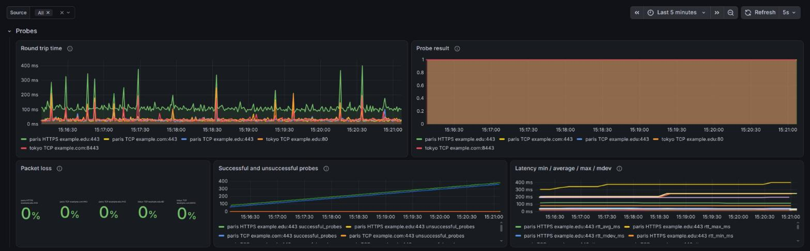
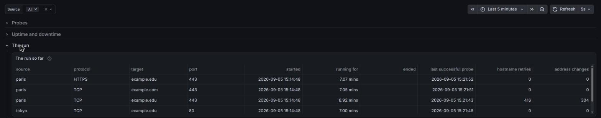
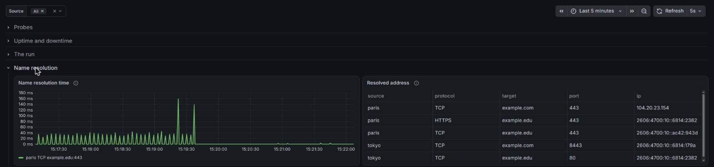
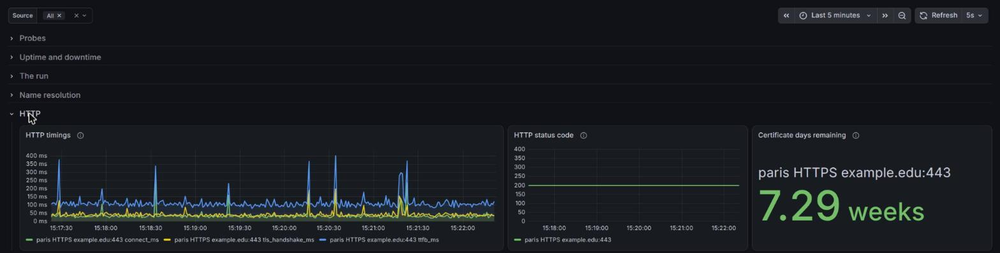
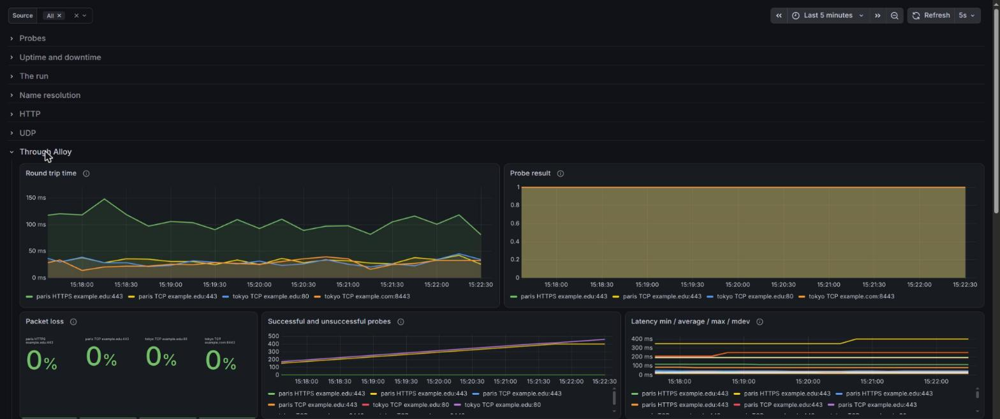

# Observing tcping

tcping can send its probes to [Grafana Alloy](https://grafana.com/docs/alloy/latest/)
or to [InfluxDB](https://www.influxdata.com/) instead of printing them, which
turns a run into a graph and lets several machines watch the same target.

This directory is a complete stack you can start in one command to try that
out, or to copy pieces of into your own setup.

## What is in here

| File | What it does |
| --- | --- |
| `compose.yml` | Alloy, Prometheus, InfluxDB and Grafana, wired together |
| `config.alloy` | Alloy taking OTLP from tcping and pushing it to Prometheus |
| `prometheus.yml` | Prometheus with nothing to scrape, it only receives |
| `grafana/provisioning/` | Both data sources, so nothing has to be clicked |
| `grafana/dashboards/tcping.json` | The dashboard |

> [!WARNING]
> Every password and token in here is a throwaway one, written in plain text
> so the stack starts without any setup. Do not reuse them anywhere, and do
> not put this stack on a network you do not control.

## Start it

```bash
cd docs/observability
docker compose up -d
```

That gives you:

- Grafana on <http://localhost:3000>, no login needed
- Alloy's UI on <http://localhost:12346>, to check it is receiving anything
- Prometheus on <http://localhost:9090>
- InfluxDB on <http://localhost:8086>, user `tcping`, password `tcping-dev-password`

Then point tcping at it. Through Alloy:

```bash
tcping --alloy http://localhost:4318 example.com 443
```

Or straight to InfluxDB:

```bash
export INFLUXDB_TOKEN=tcping-dev-token
tcping --influxdb http://localhost:8086 --influxdb-org home --influxdb-bucket tcping example.com 443
```

One tcping run sends to one place, so start a second one if you want the
same target going to both. Open the `tcping` dashboard in Grafana and the
probes start showing up.

When you are done:

```bash
docker compose down -v
```

The `-v` throws the stored metrics away too. Leave it off to keep them. The
stack only holds 6 hours of data either way.

## What tcping sends

Every probe is sent as it happens, and the whole statistics block you would
normally see on exit is sent every 10 seconds on top of that, so a run that
nobody is watching still reports it. `--stats-interval` changes that interval.

The statistics carry the packet loss, the minimum, average, maximum and mean
deviation of the latency, the total uptime and downtime, the longest streak of
each and when it ran from and to, when the last successful and unsuccessful
probes landed, how many times the hostname had to be looked up again and how
often it answered from a different address, and when the run started, how long
it has been going and when it ended. Times are sent as milliseconds since the
epoch, since a metric can only carry a number.

### Through Alloy

Every probe sends `tcping_probe_success`, `tcping_probe_rtt_milliseconds` and
`tcping_probes_total`, labelled with the source, target, port and protocol. An
HTTP(S) target also sends the status code, the connect, TLS handshake and
first-byte timings, and the days left on the certificate. A UDP target sends
whether the reply was echoed back, whether the port refused us and how big the
reply was.

The address the target resolved to is sent on its own as
`tcping_target_address`, which is always 1 and carries the address as a label.
It is kept off the probe metrics because a label is part of what identifies a
series: with `-r` or `--resolve-every-probe` a hostname that resolves somewhere
else mid-run would leave the old series behind and start a new one, which
breaks a graph into pieces and makes the counters add up wrong. Query it on its
own to see which addresses a target has been answering from:

```promql
tcping_target_address{target="www.example.com"}
```

If you want the address alongside the probes, join to it, keeping in mind that
this only works while the target has one address at a time. A round-robin
hostname has several of them live at once and the join has nothing to pick
between them:

```promql
tcping_probe_rtt_milliseconds * on (source, target, port) group_left (ip) tcping_target_address
```

### Through InfluxDB

Every probe writes one point, named after what was probed: `tcping_tcp`,
`tcping_udp` or `tcping_http`, tagged with the source, target, port and
protocol. All three hold `success`, `rtt_ms`, the address the target resolved
to in the `ip` field, and the successful and unsuccessful probe counts. The
address is a field rather than a tag for the same reason it is its own metric
on the Alloy side: tags identify a series, and a hostname that resolves
somewhere else mid-run would otherwise leave the old series behind.

A `tcping_http` point also carries the status code, the connect, TLS handshake
and first-byte timings and the days left on the certificate, and a `tcping_udp`
point carries the probe number, the size of the reply and whether it was echoed
back or refused. The statistics go to `tcping_statistics`.

The API token can be given with `--influxdb-token`, or in the `INFLUXDB_TOKEN`
environment variable, which keeps it out of your shell history. The flag wins
if both are set.

## Several machines probing the same target

Every probe carries a `source` label, which defaults to the hostname of the
machine that sent it. Two machines probing the same target therefore land in
their own series instead of on top of each other, and you can see the target
from both at once.

Use `--source-label` to name a machine yourself, which is also how to fake a
second machine on one laptop:

```bash
tcping --alloy http://localhost:4318 --source-label paris example.com 443
tcping --alloy http://localhost:4318 --source-label tokyo example.com 443
```

The **Source** dropdown at the top of the dashboard picks which ones to show.
It is filled from InfluxDB, so a machine that only sends to Alloy will not be
in the list, but **All** leaves every panel unfiltered and shows it anyway.

## The dashboard

Everything tcping sends has a panel, grouped into rows:

| Row | What is in it |
| --- | --- |
| **Probes** | Round trip time, probe result, packet loss, the successful and unsuccessful counts, and the min / average / max / mdev summary |
| **Uptime and downtime** | The running totals, the length of each uptime and downtime streak as it ends, and the longest of each with the times it ran from and to |
| **The run** | When the run started, how long it has been going, when it ended, when the last successful and unsuccessful probes landed, and how many hostname retries and address changes there were |
| **Name resolution** | How long each lookup took, and the address every target resolved to |
| **HTTP** | Connect, TLS handshake and first byte timings, the status code, and the days left on the certificate |
| **UDP** | Reply size, whether the reply carried our own payload back, and whether the port was unreachable |
| **Through Alloy** | All of the above again, read from Prometheus instead of InfluxDB |

The first two rows are open and the rest start collapsed. Every row but the
last reads from InfluxDB, so a run that only uses `--alloy` fills in the
**Through Alloy** row and leaves the others empty, and a run that only uses
`--influxdb` does the opposite.

Every panel keys its series on the source, the protocol, the target and the
port, so a legend entry reads `paris TCP github.com:443` and the same host
probed on two ports stays on two lines.

`allowUiUpdates` is on, so you can edit panels in Grafana and try things. The
edits live in Grafana's volume, not in the JSON file here, and `docker compose
down -v` throws them away. To keep one, export the dashboard JSON and write it
over `grafana/dashboards/tcping.json`.

## What it looks like

The shots below come from a handful of runs against `example.com` and
`example.edu`, two of them labelled `paris` and `tokyo` so the sources can be
told apart, with the time range set to the last 5 minutes.

**Probes** is the row you will spend most of your time in. Round trip time and
the probe result are side by side, and the packet loss, the counts and the
latency summary sit underneath:



**The run** is one line per run, so you can see at a glance how long each one
has been going and when it last got an answer:



**Name resolution** needs `--resolve-every-probe` to have anything in the
graph. The table next to it lists the address each target is currently on,
which is how you catch a target moving between addresses:



**HTTP** only fills in for an `http://` or `https://` target, and carries the
connect, TLS handshake and first byte timings, the status code, and how long
the certificate has left:



**Through Alloy** is the same set of panels read from Prometheus, so a run
using `--alloy` looks the same as one using `--influxdb`:



## Using this outside the playground

The only part of this that is really tcping-specific is `config.alloy`: an
OTLP receiver on 4318, an exporter that turns the metrics into Prometheus
ones, and a remote write to wherever your Prometheus lives. Point the URL at
your own Prometheus and it works the same.

> [!NOTE]
> Prometheus needs `--web.enable-remote-write-receiver` for Alloy to be able
> to push to it.

For InfluxDB there is no middle piece at all, tcping writes line protocol
directly, so an existing v2 or v3 server only needs an org, a bucket and a
token.

The metrics and the fields are the same wherever they land, see
[what tcping sends](#what-tcping-sends).

## Nothing is showing up

- Alloy's UI on <http://localhost:12346> shows the health of each component.
  If the receiver is healthy but the remote write is not, Prometheus is the
  problem.
- A rejected write does not stop the run. tcping prints the error to stderr
  and says the metrics are being dropped, then keeps probing, so watch stderr
  rather than the probe output. A wrong InfluxDB token shows up this way.
- The statistics panels only fill in after the first statistics push, which is
  every 10 seconds by default. `--stats-interval` changes that.
- **Name resolution time** stays empty unless the hostname is looked up more
  than once, so it needs `--resolve-every-probe` or a target that goes away.
- **Length of each uptime and downtime streak** only gets a point when a
  streak ends, so a target that never flips leaves it empty.
- **Total uptime and downtime** are only added up when the target changes
  state, so a target that has been up since the run started reads 0 until it
  goes down. That is also what the statistics block in the terminal shows when
  you press Enter mid-run.
- The **ended** column of **The run so far** stays empty until the run
  finishes, since that is the only summary carrying an end time.
