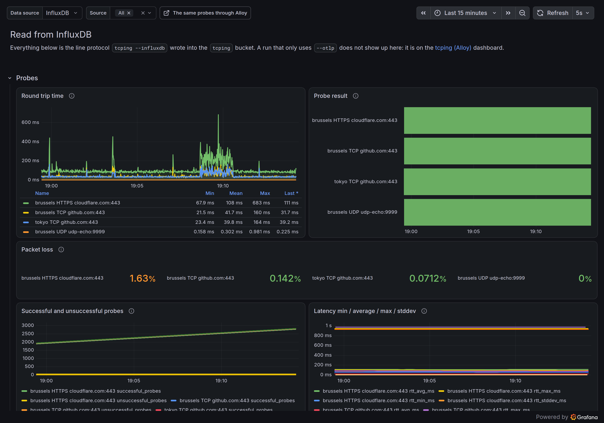
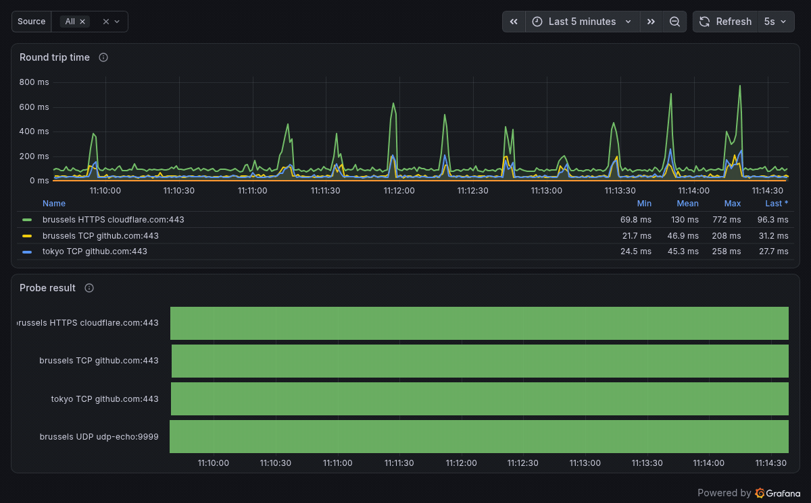
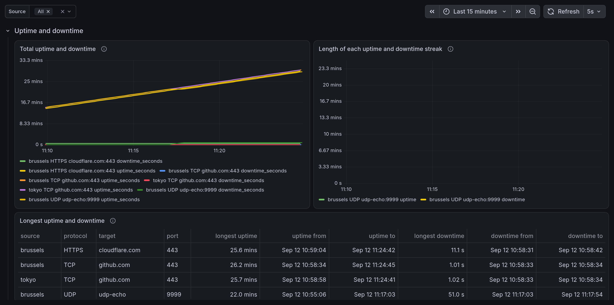
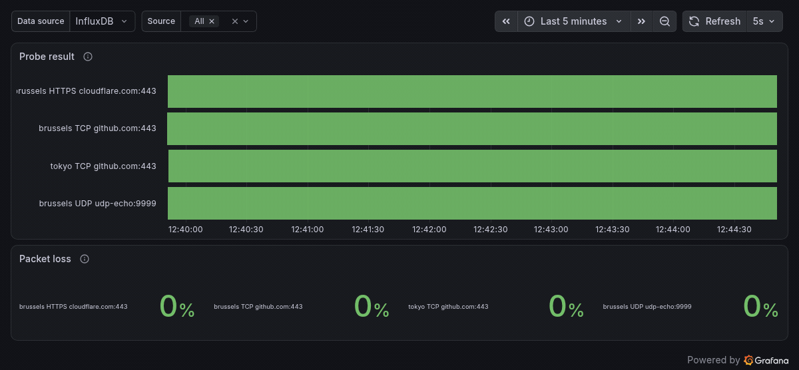
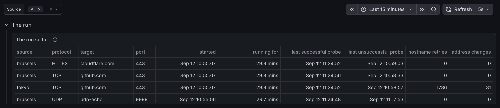
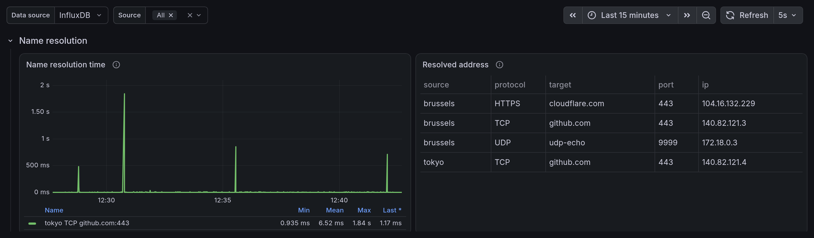
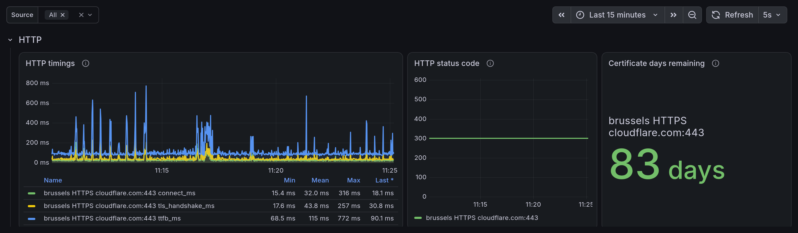
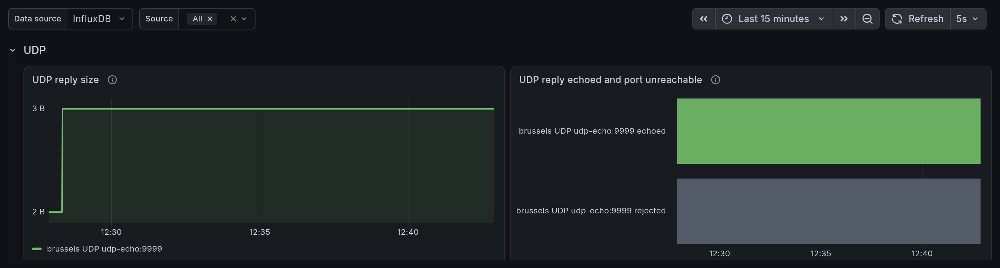
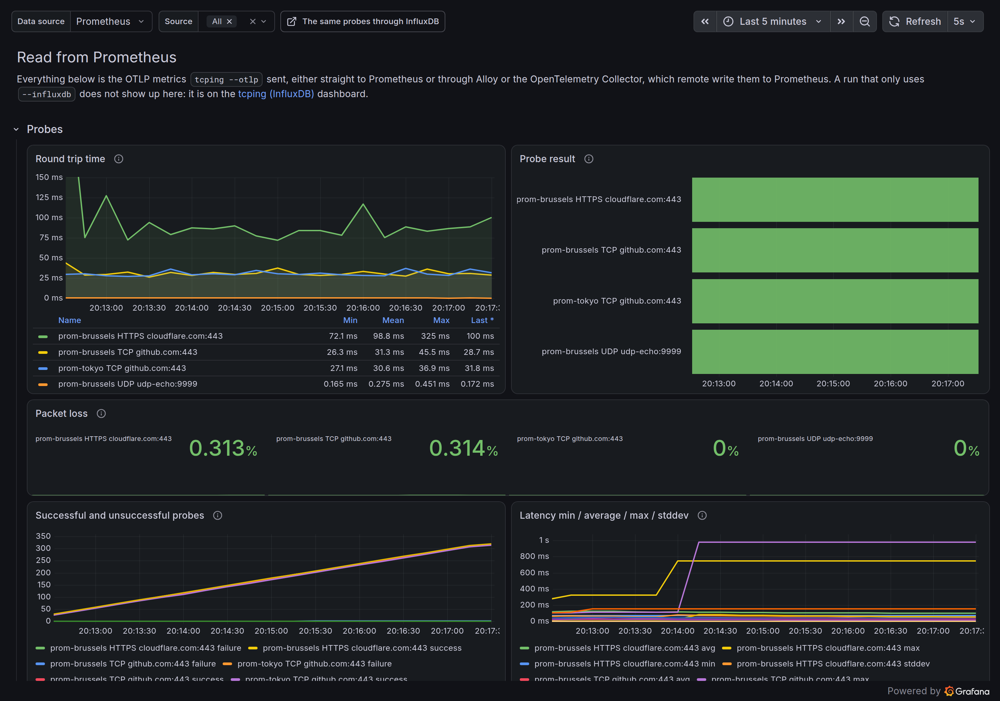

# Observing tcping

tcping can send its probes over OTLP, to [Prometheus](https://prometheus.io/),
[Grafana Alloy](https://grafana.com/docs/alloy/latest/) or the
[OpenTelemetry Collector](https://opentelemetry.io/docs/collector/), or to
[InfluxDB](https://www.influxdata.com/), instead of printing them. That turns
a run into a graph and lets several machines watch the same target.

This directory holds a stack for each of those, which you can start on its
own or together with the others, to try them out or to copy pieces of into
your own setup. tcping is part of every stack, so starting one gives you
graphs with something in them straight away, without having to run anything
by hand.

## What is in here

| File | What it does |
| --- | --- |
| `compose.prometheus.yml` | tcping sending OTLP straight to Prometheus |
| `compose.alloy.yml` | tcping sending OTLP to Alloy, which pushes it to Prometheus |
| `compose.otelcol.yml` | tcping sending OTLP to the OpenTelemetry Collector, which pushes it to Prometheus |
| `compose.influxdb.yml` | tcping writing straight to InfluxDB |
| `config.alloy` | Alloy taking OTLP from tcping and pushing it to Prometheus |
| `otelcol.yaml` | The collector doing the same |
| `prometheus.yml` | Prometheus with nothing to scrape, it only receives |
| `grafana/provisioning/` | Both data sources and both dashboards, so nothing has to be clicked |
| `grafana/dashboards/tcping-prometheus.json` | The dashboard reading from Prometheus |
| `grafana/dashboards/tcping-influxdb.json` | The same dashboard reading from InfluxDB |

> [!WARNING]
> Every password and token in here is a throwaway one, written in plain text
> so the stack starts without any setup. Do not reuse them anywhere, and do
> not put this stack on a network you do not control.

## Start it

Pick the way you want tcping to send its probes, and start that file:

```bash
cd docs/observability && docker compose -f compose.prometheus.yml up -d
```

| File | Path the probes take |
| --- | --- |
| `compose.prometheus.yml` | tcping, then Prometheus |
| `compose.alloy.yml` | tcping, then Alloy, then Prometheus |
| `compose.otelcol.yml` | tcping, then the OpenTelemetry Collector, then Prometheus |
| `compose.influxdb.yml` | tcping, then InfluxDB |

Or start several at once to compare them, by passing more than one `-f`:

```bash
cd docs/observability && \
  docker compose -f compose.prometheus.yml -f compose.alloy.yml -f compose.otelcol.yml -f compose.influxdb.yml up -d
```

The parts they share, Prometheus, Grafana and `udp-echo`, are written the same
way in every file, so they are started once however many files you pass.

The tcping containers use the `pouriyajamshidi/tcping:v3` image. Until v3 is
released that tag is not on any registry, so the first `docker compose up`
builds it from this repository. Once v3 is out, `docker compose pull` replaces
it with the published one and nothing in the compose files has to change.

Depending on the files you started, that gives you:

- Grafana on <http://localhost:3000>, no login needed, with both dashboards
- Prometheus on <http://localhost:9090>, taking OTLP on `/api/v1/otlp`
- Alloy on <http://localhost:4318>, with its UI on <http://localhost:12346> to check it is receiving anything
- The collector on <http://localhost:4319>, since Alloy has 4318 when both are started
- InfluxDB on <http://localhost:8086>, user `tcping`, password `tcping-dev-password`

Every file starts the same four tcping runs, pointed at its own backend:

| Container | What it probes | Source label |
| --- | --- | --- |
| `tcping-<backend>-tcp-brussels` | `github.com:443` over TCP | `<prefix>-brussels` |
| `tcping-<backend>-tcp-tokyo` | the same, resolving every probe | `<prefix>-tokyo` |
| `tcping-<backend>-https` | `https://cloudflare.com` | `<prefix>-brussels` |
| `tcping-<backend>-udp` | `udp-echo:9999` over UDP | `<prefix>-brussels` |
| `udp-echo` | nothing, it is `tcping --udp-server` answering the UDP probes | |

`<backend>` is `prometheus`, `alloy`, `otelcol` or `influxdb`, and `<prefix>`
is `prom`, `alloy` or `otelcol`. The prefix is there because those three all
land in the same Prometheus, and without it they would write over each
other's series. The InfluxDB runs are just `brussels` and `tokyo`: they are
the only ones in their own database, so they have nothing to be told apart
from.

The `--resolve-every-probe` on the `tokyo` runs is what puts anything in the
**Name resolution** row, and `udp-echo` is tcping listening instead of
probing, so the UDP probes get a real reply from inside the stack.

Stop one of them if you want to watch a target go down:

```bash
docker compose -f compose.prometheus.yml stop udp-echo
```

When you are done, pass the same `-f` files you started with:

```bash
docker compose -f compose.prometheus.yml down -v
```

The `-v` throws the stored metrics away too. Leave it off to keep them. The
stack only holds 6 hours of data either way.

## Pointing your own tcping at it

The stack listens for anything, not only its own containers. Straight to
Prometheus:

```bash
tcping --otlp http://localhost:9090/api/v1/otlp example.com 443
```

Through Alloy, or through the collector on 4319:

```bash
tcping --otlp http://localhost:4318 example.com 443
```

Or straight to InfluxDB:

```bash
export INFLUXDB_TOKEN=tcping-dev-token && \
  tcping --influxdb http://localhost:8086 --influxdb-org home --influxdb-bucket tcping example.com 443
```

One tcping run sends to one place, so start a second one if you want the same
target going to both.

## What tcping sends

Every probe is sent as it happens, and the whole statistics block you would
normally see on exit is sent every 10 seconds on top of that, so a run that
nobody is watching still reports it. `--stats-interval` changes that interval.

The statistics carry the packet loss, the minimum, average, maximum and mean
deviation of the latency, the total uptime and downtime, the longest streak of
each and when it ran from and to, when the last successful and unsuccessful
probes landed, how many times the hostname had to be looked up again and how
often it answered from a different address, and when the run started, how long
it has been going and when it ended. Times are sent as milliseconds since the
epoch, since a metric can only carry a number.

### Over OTLP

Every probe sends `tcping_probe_success`, `tcping_probe_rtt_milliseconds` and
`tcping_probes_total`, labelled with the source, target, port and protocol. An
HTTP(S) target also sends the status code, the connect, TLS handshake and
first-byte timings, and the days left on the certificate. A UDP target sends
whether the reply was echoed back, whether the port refused us and how big the
reply was.

The address the target resolved to is sent on its own as
`tcping_target_address`, which is always 1 and carries the address as a label.
It is kept off the probe metrics because a label is part of what identifies a
series: with `-r` or `--resolve-every-probe` a hostname that resolves somewhere
else mid-run would leave the old series behind and start a new one, which
breaks a graph into pieces and makes the counters add up wrong. Query it on its
own to see which addresses a target has been answering from:

```promql
tcping_target_address{target="github.com"}
```

If you want the address alongside the probes, join to it, keeping in mind that
this only works while the target has one address at a time. A round-robin
hostname has several of them live at once and the join has nothing to pick
between them:

```promql
tcping_probe_rtt_milliseconds * on (source, target, port) group_left (ip) tcping_target_address
```

### Through InfluxDB

Every probe writes one point, named after what was probed: `tcping_tcp`,
`tcping_udp` or `tcping_http`, tagged with the source, target, port and
protocol. All three hold `success`, `rtt_ms`, the address the target resolved
to in the `ip` field, and the successful and unsuccessful probe counts. The
address is a field rather than a tag for the same reason it is its own metric
on the OTLP side: tags identify a series, and a hostname that resolves
somewhere else mid-run would otherwise leave the old series behind.

A `tcping_http` point also carries the status code, the connect, TLS handshake
and first-byte timings and the days left on the certificate, and a `tcping_udp`
point carries the probe number, the size of the reply and whether it was echoed
back or refused. The statistics go to `tcping_statistics`, each ended uptime
and downtime streak to `tcping_uptime` and `tcping_downtime`, and each hostname
lookup to `tcping_name_resolution`.

The API token can be given with `--influxdb-token`, or in the `INFLUXDB_TOKEN`
environment variable, which keeps it out of your shell history. The flag wins
if both are set. The containers in `compose.influxdb.yml` use the environment variable.

## Several machines probing the same target

Every probe carries a `source` label, which defaults to the hostname of the
machine that sent it. Two machines probing the same target therefore land in
their own series instead of on top of each other, and you can see the target
from both at once.

Use `--source-label` to name a machine yourself, which is also how to fake a
second machine on one laptop, and what the stack does to get its `brussels`
and `tokyo`:

```bash
tcping --otlp http://localhost:4318 --source-label brussels example.com 443
tcping --otlp http://localhost:4318 --source-label tokyo example.com 443
```

The **Source** dropdown at the top of each dashboard picks which ones to show,
and is filled from that dashboard's own data source.

## The dashboards

There are two, holding the same panels in the same places:

- **tcping (Prometheus)** reads the metrics `--otlp` sent, whether they went
  straight to Prometheus or through Alloy or the collector. All three come
  out with the same names and labels.
- **tcping (InfluxDB)** reads the points `--influxdb` wrote.

Which one to open is simply which way you sent the run. They are kept apart
rather than mixed into one dashboard because Flux and PromQL are different
query languages, so a single panel cannot be pointed at both. Each carries a
line at the top saying which it reads and a link to the other one, so the same
run can be compared side by side.

Every panel tcping can fill has a place in both, grouped into rows:

| Row | What is in it |
| --- | --- |
| **Probes** | Round trip time, probe result, packet loss, the successful and unsuccessful counts, and the min / average / max / stddev summary |
| **Uptime and downtime** | The running totals, the length of each uptime and downtime streak as it ends, how many outages each target had, and the longest of each with the times it ran from and to |
| **The run** | When the run started, how long it has been going, when it ended, when the last successful and unsuccessful probes landed, and how many hostname retries and address changes there were |
| **Name resolution** | How long each lookup took, and the address every target resolved to |
| **HTTP** | Connect, TLS handshake and first byte timings, the status code, and the days left on the certificate |
| **UDP** | Reply size, whether the reply carried our own payload back, and whether the port was unreachable |

The first two rows are open and the rest start collapsed. A row only fills in
when a run is feeding it: **HTTP** needs an `http://` or `https://` target,
**UDP** needs a `udp://` one, and **Name resolution** needs a hostname that is
looked up more than once.

Every panel keys its series on the source, the protocol, the target and the
port, so a legend entry reads `brussels TCP github.com:443` and the same host
probed on two ports stays on two lines.

`allowUiUpdates` is on, so you can edit panels in Grafana and try things. The
edits live in Grafana's volume, not in the JSON files here, and `docker compose
down -v` throws them away. To keep one, export the dashboard JSON and write it
over the file in `grafana/dashboards/`.

## What it looks like

The shots below are the stack running for about half an hour, with the time
range set to the last 15 minutes.

**Probes** is the row you will spend most of your time in. Round trip time and
the probe result are side by side, the packet loss of every run sits under
them, and the counts and the latency summary under that:



Probes are sent as they happen, so the graphs fill in on their own:



**Uptime and downtime** is where an outage ends up. The totals climb, each
streak gets a point when it ends, the outage count under them says how many
times each target went down, and the table underneath keeps the longest of
each with the times it ran from and to:



Stopping `udp-echo` is enough to see it happen. The UDP target goes red, its
packet loss climbs, and both recover when the container comes back:



**The run** is one line per run, so you can see at a glance how long each one
has been going and when it last got an answer. The `tokyo` line is the one
resolving every probe, which is why it is the only one with hostname lookups
and address changes to report:



**Name resolution** needs `--resolve-every-probe` to have anything in the
graph, which is why the stack passes it to the `tokyo` runs. The table next to
it lists the address each target is currently on, which is how you catch a
target moving between addresses:



**HTTP** only fills in for an `http://` or `https://` target, and carries the
connect, TLS handshake and first byte timings, the status code, and how long
the certificate has left:



**UDP** tells a lost probe apart from a refused one: a reply carrying our own
payload back is the only proof something is listening, and a refusal the only
proof nothing is:



And **tcping (Prometheus)** is the same set of panels reading from
Prometheus, so a run using `--otlp` looks like one using `--influxdb`. This
one is `compose.prometheus.yml` over the last 5 minutes:



## Using this outside the playground

The simplest setup needs nothing between tcping and Prometheus. Start your
Prometheus with `--web.enable-otlp-receiver` and point tcping at it:

```bash
tcping --otlp http://your-prometheus:9090/api/v1/otlp example.com 443
```

Alloy or the collector are worth adding when you want to send the same
metrics to several places, or change them on the way. The only tcping-specific
part of either is its config, `config.alloy` or `otelcol.yaml`: an OTLP
receiver on 4318, and a remote write to wherever your Prometheus lives. Point
the URL at your own Prometheus and it works the same. The collector needs the
`contrib` image, which is the one carrying the remote write exporter.

> [!NOTE]
> Prometheus needs `--web.enable-remote-write-receiver` for Alloy or the
> collector to be able to push to it.

> [!NOTE]
> The collector's exporter used to be called `prometheusremotewrite`. That
> name still works, but the collector logs a deprecation warning for it, so
> write new configs with `prometheus_remote_write`.

The metric names and labels come out the same whichever of the three you use,
so **tcping (Prometheus)** is the dashboard to open for all of them.

For InfluxDB there is no middle piece at all, tcping writes line protocol
directly, so an existing v2 or v3 server only needs an org, a bucket and a
token.

The metrics and the fields are the same wherever they land, see
[what tcping sends](#what-tcping-sends).

Anything else that speaks OTLP over HTTP works the same way, including hosted
backends. Those usually want a token, which goes in with
`--otlp-header "Authorization: Bearer <token>"` or the `OTLP_HEADER`
environment variable.

### Taking a dashboard to your own Grafana

Both dashboards read their data source from a **Data source** dropdown rather
than naming one, so importing either into a Grafana you already have does not
mean editing any JSON:

1. Open **Dashboards**, then **New**, then **Import**.
2. Paste the contents of `grafana/dashboards/tcping-influxdb.json`, or
   `tcping-prometheus.json` for the Prometheus one, and press **Load**.
3. Pick a folder and press **Import**.

It lands next to your existing dashboards as its own entry, without touching
them. The **Data source** dropdown at the top then picks which of your
InfluxDB, or Prometheus, servers to read.

Two things to know:

- The InfluxDB dashboard reads the bucket name from a `bucket` variable,
  which is set to `tcping`. If your bucket is called something else, change it
  once under **Dashboard settings**, then **Variables**, then **bucket**.
- Importing only one of the two leaves the link at the top pointing at a
  dashboard you do not have. Import both, or delete the link under
  **Dashboard settings**, then **Links**.

To lift single panels into a dashboard you already have rather than importing
the whole thing, import it first, then use a panel's menu, **Copy**, and
**Paste panel** on the other dashboard.

> [!IMPORTANT]
> The InfluxDB dashboard's queries are written in **Flux**, so its data source
> has to be an InfluxDB **v2** one with the query language set to Flux.
> tcping writes happily to InfluxDB **v3**, which speaks the same line
> protocol, but v3 dropped Flux, so the panels come up empty against it and
> the queries would have to be rewritten in SQL. Until that dashboard exists,
> v3 users are better served by the Prometheus side.

## Nothing is showing up

- Check the probes are happening at all with
  `docker compose -f compose.influxdb.yml logs tcping-influxdb-tcp-brussels`.
  Each container prints one line saying what it is probing and where the
  metrics are going, and nothing after that.
- Alloy's UI on <http://localhost:12346> shows the health of each component.
  If the receiver is healthy but the remote write is not, Prometheus is the
  problem. The collector logs a failed remote write in
  `docker compose -f compose.otelcol.yml logs otelcol`.
- A rejected write does not stop the run. tcping prints an error to stderr
  for every write that fails and keeps probing, so watch stderr rather than
  the probe output. A wrong InfluxDB token shows up this way.
- Make sure you are on the dashboard for the way you sent the run. A run using
  `--otlp` leaves **tcping (InfluxDB)** empty, and the other way round.
- The statistics panels only fill in after the first statistics push, which is
  every 10 seconds by default. `--stats-interval` changes that.
- **Name resolution time** stays empty unless the hostname is looked up more
  than once, so it needs `--resolve-every-probe` or a target that goes away.
- **Length of each uptime and downtime streak** only gets a point when a
  streak ends, so a target that never flips leaves it empty.
- **Total uptime and downtime** are only added up when the target changes
  state, so a target that has been up since the run started reads 0 until it
  goes down. That is also what the statistics block in the terminal shows when
  you press Enter mid-run.
- The **ended** column of **The run so far** stays empty until the run
  finishes, since that is the only summary carrying an end time.
